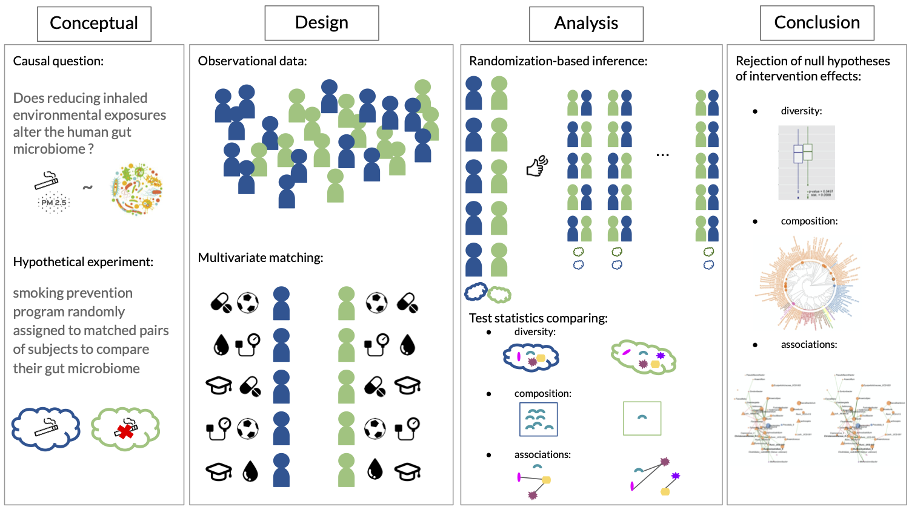

# Randomization-based causal inference framework to analyze 16s rRNA gut microbiome data.

Causal inference framework for environment-microbiome data applied to American Gut data.

## Framework

## Data access

American Gut Data.

## Stage 2: Design

The R code for our pair matching implementation and diagnostic plots generation can be found in the [`design_AG`](design_AG) file. The matrix of 10,000 possible randomization of the intervention assignment is also generated directly after matching.

*Note 1*: the matching functions [Stephane_matching.R](misc/Stephane_matching.R) were written in Rcpp by Stéphane Shao.

*Note 2*: other matching strategies are valid. The researcher should take the conceptual hypothetical experiment into account when choosing its strategy.

## Stage 3: Analysis

The ASV (or OTU) data table and matched dataset are combined in a [phyloseq](https://joey711.github.io/phyloseq/) object before making statistical analyses. Thus, the following code can be used for any other data combined in a phyloseq object.

### Diversity

#### Richness and alpha-diversity

R code in [`1_alpha_diversity_AG`](1_alpha_diversity_AG) folder.

We used Amy Willis' R packages [`breakaway`](https://github.com/adw96/breakaway) for richness estimation [[Willis and Bunge, 2015](https://onlinelibrary.wiley.com/doi/abs/10.1111/biom.12332)] and [`DivNet`](https://github.com/adw96/DivNet) for Shannon index estimation [[Willis, 2020](https://academic.oup.com/biostatistics/advance-article-abstract/doi/10.1093/biostatistics/kxaa015/5841114)].

<ins>Richness result: </ins> 
estimate: 108.3931; p-value: 0.133 

<ins>Shannon index result: </ins>
estimate: -0.008072164; p-value: 0.659 

#### Beta-diversity

R code in [`2_beta_diversity_AG`](2_beta_diversity_AG) folder.

The distance calculations where done with the phyloseq package and we used Anna Plantinga's R package [`MiRKAT`](https://cran.r-project.org/web/packages/MiRKAT/index.html) for the test statistic calculations [[Zhao et al., 2015](https://www.ncbi.nlm.nih.gov/pmc/articles/PMC4570290/)].

<ins>Results: </ins> 
- Aitchison:
estimate: 822866.9; p-value(adj.): 0.002
- Jaccard:
estimate: 132.9856; p-value(adj.): 0.002 
- Gower:
estimate: 0.3761873; p-value(adj.): 0.501

### Compostion

#### Compositional equivalence

R code in [`3_mean_diff_test_AG`](3_mean_diff_test_AG) folder.
 
Cao, Lin, and Li's github repository: [`composition-two-sampe-test`](https://github.com/yuanpeicao/composition-two-sampe-test) [[Cao, Lin, and Li, 2018](https://academic.oup.com/biomet/article/105/1/115/4591648)].

<ins>Result: </ins>
estimate: 50.0806; p-value: 0.001

#### Differential abundance

R code in [`4_differential_abundance_AG`](4_differential_abundance_AG) folder.

We use the function `dacomp.test()` of Barak Brill' R package: [`dacomp`](https://github.com/barakbri/dacomp) to calculate the test statistic for all taxa at once [[Brill, Amir, and Heller, 2020](https://arxiv.org/abs/1904.08937)].

<ins>Reference set: </ins>
k_Bacteria;p_Firmicutes;c_Clostridia;o_Clostridiales;f_Lachnospiraceae;g_Dorea\\
k_Bacteria;p_Firmicutes;c_Clostridia;o_Clostridiales;f_Lachnospiraceae;g_NA     

<ins>Results: </ins>
Genera with p-value <= 0.02. \\
k_Bacteria;p_Proteobacteria;c_Gammaproteobacteria;o_Enterobacteriales;f_Enterobacteriaceae;g_Raoultella\\
k_Bacteria;p_Firmicutes;c_Clostridia;o_Clostridiales;f_Lachnospiraceae;g_Anaerostipes\\
k_Bacteria;p_Proteobacteria;c_Alphaproteobacteria;o_Rickettsiales;f_mitochondria;g_Sarcandra  

#### Correlation structure

R code in [`5_networks_AG`](5_networks_AG) folder.

[Peschel et al.'s (2020)](https://academic.oup.com/bib/advance-article/doi/10.1093/bib/bbaa290/6017455) R package [`NetCoMi`](https://github.com/stefpeschel/NetCoMi) enables the estimation and comparision of networks for compositional data.

## References

[Holle et al., 2005] Holle R, Happich M, Löwel H, Wichmann HE (2005); [MONICA/KORA Study Group. KORA--a research platform for population based health research.](https://pubmed.ncbi.nlm.nih.gov/16032513/) *Gesundheitswesen*, 67. 

[Willis and Bunge, 2015] Willis A and Bunge J (2015); [Estimating diversity via frequency ratios.](https://onlinelibrary.wiley.com/doi/abs/10.1111/biom.12332) *Biometric Methodology*, 71:1042-1049.

[Willis and Bryan, 2020]  Willis A and Bryan DM (2020); [Estimating diversity in networked ecological communities](https://academic.oup.com/biostatistics/advance-article-abstract/doi/10.1093/biostatistics/kxaa015/5841114) *Biostatistics*, kxaa015.

[Zhao et al., 2015] Zhao N, Chen J, Carroll IM et al. (2015); [Testing in Microbiome-Profiling Studies with MiRKAT, the Microbiome Regression-Based Kernel Association Test.](https://www.ncbi.nlm.nih.gov/pmc/articles/PMC4570290/) *Am J Hum Genet.*, 96(5):797-807.

[Cao, Lin, Li, 2018] Cao Y, Lin W, and Li H (2018); [Two-sample tests of high-dimensional means for compositional data.](https://academic.oup.com/biomet/article/105/1/115/4591648) *Biometrika*, 105:115-132.

[Brill, Amir, and Heller, 2020] Brill B, Amir A, and Heller R (2020) [Testing for differential abundance in compositional counts data, with application to microbiome studies.](https://arxiv.org/abs/1904.08937)] *arXiv*

[Peschel et al., 2020] Peschel et al. (2020) [NetCoMi: network construction and comparison for microbiome data in R.](https://academic.oup.com/bib/advance-article/doi/10.1093/bib/bbaa290/6017455) *Briefings in Bioinformatics*, bbaa290.

