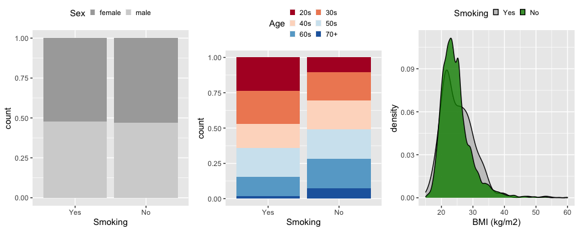
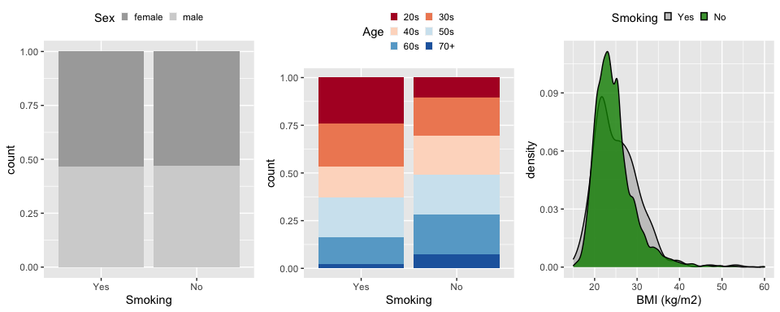

Design stage
================

## American gut data

``` r
load('./agdata.rda')
agdata
```

    ## phyloseq-class experiment-level object
    ## otu_table()   OTU Table:         [ 34491 taxa and 27017 samples ]
    ## sample_data() Sample Data:       [ 27017 samples by 659 sample variables ]
    ## tax_table()   Taxonomy Table:    [ 34491 taxa by 13 taxonomic ranks ]

### Exposure/Intervention

``` r
# grep('smok',colnames(sample_data(agdata)))
colnames(sample_data(agdata))[61]; table(sample_data(agdata)[,61])
```

    ## [1] "smoking_frequency"

    ## 
    ##                                                       Daily 
    ##                          2789                           372 
    ##               LabControl test                         Never 
    ##                           268                         21792 
    ##                  Not provided Occasionally (1-2 times/week) 
    ##                           466                           283 
    ##    Rarely (a few times/month)    Regularly (3-5 times/week) 
    ##                           921                           126

``` r
# keep samples of smoker and never-smoker
agdata_smoke <- prune_samples(sample_data(agdata)$smoking_frequency %in% c('Daily','Never'), agdata)
rm(agdata)

agdata_smoke
```

    ## phyloseq-class experiment-level object
    ## otu_table()   OTU Table:         [ 34491 taxa and 22164 samples ]
    ## sample_data() Sample Data:       [ 22164 samples by 659 sample variables ]
    ## tax_table()   Taxonomy Table:    [ 34491 taxa by 13 taxonomic ranks ]

### Background covariates

``` r
# grep('sex',colnames(sample_data(agdata_smoke)))
# colnames(sample_data(agdata_smoke))[20]
table(sample_data(agdata_smoke)[,20])
```

    ## 
    ##       female         male Not provided  unspecified        other 
    ##        11513        10122          476           35           18

``` r
agdata_smoke <- prune_samples(sample_data(agdata_smoke)$sex %in% c('female','male'), agdata_smoke)

# grep('age_cat',colnames(sample_data(agdata_smoke)))
# colnames(sample_data(agdata_smoke))[309]
table(sample_data(agdata_smoke)[,309])
```

    ## 
    ##                       20s          30s          40s          50s          60s 
    ##          606         1966         3714         3889         4107         3937 
    ##          70+        child Not provided         teen 
    ##         1402          894          628          492

``` r
agdata_smoke <- prune_samples(!sample_data(agdata_smoke)$age_cat %in% c('Not provided','','child','teen'), agdata_smoke)

# grep('bmi',colnames(sample_data(agdata_smoke)))
# colnames(sample_data(agdata_smoke))[109]
summary(sample_data(agdata_smoke)[,109])
```

    ##       bmi_corrected  
    ##  Not provided: 6222  
    ##  25.46       :  289  
    ##  23.09       :   82  
    ##  21.93       :   65  
    ##  21.97       :   60  
    ##  22.96       :   60  
    ##  (Other)     :12237

``` r
agdata_smoke <- prune_samples(!sample_data(agdata_smoke)$bmi_corrected %in% c('Not provided',''), agdata_smoke)

# str(sample_data(agdata_smoke)[,c(20,309,109)])
sample_data(agdata_smoke)$bmi_corrected <- as.numeric(as.character(sample_data(agdata_smoke)$bmi_corrected))
summary(sample_data(agdata_smoke)[,c(20,309,109)])
```

    ##      sex       age_cat    bmi_corrected  
    ##  female:6763   20s:1367   Min.   : 8.58  
    ##  male  :5975   30s:2544   1st Qu.:21.47  
    ##                40s:2584   Median :23.74  
    ##                50s:2665   Mean   :24.66  
    ##                60s:2654   3rd Qu.:26.58  
    ##                70+: 924   Max.   :65.37

## Matching

### prepare before matching data

``` r
data <- data.frame(sample_data(agdata_smoke))

# create the exposure variable
data$W <- NA
data[data$smoking_frequency == "Daily",]$W <- 0 # raucher
data[data$smoking_frequency == "Never",]$W <- 1 # nie-raucher
table(data$W)
```

    ## 
    ##     0     1 
    ##   250 12488

### before matching background covariates plots

``` r
### Sex 
g_sex <- ggplot(data, aes(x = factor(W), fill = sex)) +
  geom_bar(position = "fill") +
  scale_fill_manual(name = "Sex", values = c('darkgray','lightgray')) +
  scale_x_discrete(name = "Smoking", breaks = c(0,1), labels = c("Yes","No")) +
  theme(legend.position = "top", legend.key.size =  unit(0.1, "in"))
### Age
g_age <- ggplot(data, aes(x = factor(W), fill = age_cat)) +
  geom_bar(position = "fill") +
  scale_fill_brewer(name = "Age", 
                   palette="RdBu") +
  scale_x_discrete(name = "Smoking", breaks = c(0,1), labels = c("Yes","No")) +
  theme(legend.position = "top", legend.key.size =  unit(0.1, "in")) + guides(fill=guide_legend(nrow=3,byrow=TRUE))
### BMI
g_bmi <- ggplot(data, aes(x = bmi_corrected, fill = factor(W)))  +
  geom_density(alpha = .8) + xlab("BMI (kg/m2)") +
  scale_fill_manual(name = "Smoking", breaks = c(0,1),
                    labels=c("Yes","No"), values = c('gray','green4')) +
  xlim(c(15,60)) +   
  theme(legend.position = "top", legend.key.size =  unit(0.1, "in"))

grid.arrange(g_sex,g_age,g_bmi, ncol = 3)
```

<!-- -->

### create pairs of samples

``` r
# import Rcpp functions for pair matching 
source("../misc/Stephane_matching.R")
```

``` r
data_match = data

data_match$is_treated = as.logical(data_match$W)
data_match$pair_nb = NA

# Optional weights for each covariate when computing the distances
# WARNING: the order of the items in scaling needs to be the same as the order of the covariates (i.e. columns)
scaling =  rep(list(1),ncol(data_match))
names(scaling) = colnames(data_match)
# set the thresholds for each covariate, default is Inf (i.e. no matching)
thresholds = rep(list(Inf),ncol(data_match))
names(thresholds) = colnames(data_match)
# set particular values

thresholds$sex = 0
thresholds$age_cat = 1
thresholds$bmi_corrected = 4

relevant_fields = colnames(data_match)[which(unlist(thresholds)<Inf)]
relevant_fields = c(relevant_fields, "is_treated")

matched_df = data.frame()
total_nb_match = 0
count = 0

start_time = Sys.time()
pb = txtProgressBar(min = 0, max = dim(data_match)[1], initial = 0, char = "=", style = 3)
```

    ##   |                                                                              |                                                                      |   0%

``` r
count = 0

N = nrow(data_match)
#--------- explore treated units ---------#
treated_units = subset(data_match,is_treated)
control_units = subset(data_match,!is_treated)
N_treated = nrow(treated_units)
# if (N_treated==0){
#   next
# }
N_control = nrow(control_units)
# if (N_control==0){
#   next
# }
cat("Number of treated units:", N_treated,"\nNumber of control units:", N_control,"\n")
```

    ## Number of treated units: 12488 
    ## Number of control units: 250

``` r
#--------------------------------------------------------------------------------------------------------------#
# Compute the discrepancies
discrepancies = discrepancyMatrix(treated_units, control_units, thresholds, scaling)
# N_possible_matches = sum(rowSums(discrepancies<Inf)>0)
# cat("Number of prospective matched treated units =", N_possible_matches,"\n")
# if (N_possible_matches==0){
#   next
# }
#------------------ Force pair matching via bipartite maximal weighted matching -----------------#
adj = (discrepancies<Inf)
edges_mat = which(adj,arr.ind = TRUE)
weights = 1/(1+sapply(1:nrow(edges_mat),function(i)discrepancies[edges_mat[i,1],edges_mat[i,2]]))
edges_mat[,"col"] = edges_mat[,"col"] + N_treated
edges_vector = c(t(edges_mat))
#-----------------------------------------------------------------------------
# Build the graph from the list of edges
BG = make_bipartite_graph(c(rep(TRUE,N_treated),rep(FALSE,N_control)), edges = edges_vector)
MBM = maximum.bipartite.matching(BG,weights = weights)

# List the dates of the matched pairs
pairs_list = list()
N_matched = 0
for (i in 1:N_treated){
  if (!is.na(MBM$matching[i])){
    N_matched = N_matched + 1
    pairs_list[[N_matched]] = c(i,MBM$matching[i]-N_treated)
  }
}
# Quick sanity check for matched pairs
for (i in 1:N_matched){
  
  total_nb_match = total_nb_match + 1
  # save pair number
  treated_units[pairs_list[[i]][1],"pair_nb"] = total_nb_match
  control_units[pairs_list[[i]][2],"pair_nb"] = total_nb_match
  
  matched_df = rbind(matched_df,treated_units[pairs_list[[i]][1],])
  matched_df = rbind(matched_df,control_units[pairs_list[[i]][2],])
  # cat("\n-------------------- Matched pair", total_nb_match,"--------------------\n")
  # print(treated_units[pairs_list[[i]][1],relevant_fields])
  # print(control_units[pairs_list[[i]][2],relevant_fields])
} 
count = count + 1
setTxtProgressBar(pb,count)
print(Sys.time()-start_time)
```

    ## Time difference of 38.0577 secs

``` r
table(matched_df$W)
```

    ## 
    ##   0   1 
    ## 250 250

### after matching background covariates plots

``` r
### Sex 
g_sex_after <- ggplot(matched_df, aes(x = factor(W), fill = sex)) +
  geom_bar(position = "fill") +
  scale_fill_manual(name = "Sex", values = c('darkgray','lightgray')) +
  scale_x_discrete(name = "Smoking", breaks = c(0,1), labels = c("Yes","No")) +
  theme(legend.position = "top", legend.key.size =  unit(0.1, "in"))
### Age
g_age_after <- ggplot(matched_df, aes(x = factor(W), fill = age_cat)) +
  geom_bar(position = "fill") +
  scale_fill_brewer(name = "Age", 
                   palette="RdBu") +
  scale_x_discrete(name = "Smoking", breaks = c(0,1), labels = c("Yes","No")) +
  theme(legend.position = "top", legend.key.size =  unit(0.1, "in")) + guides(fill=guide_legend(nrow=3,byrow=TRUE))
### BMI
g_bmi_after <- ggplot(matched_df, aes(x = bmi_corrected, fill = factor(W)))  +
  geom_density(alpha = .8) + xlab("BMI (kg/m2)") +
  scale_fill_manual(name = "Smoking", breaks = c(0,1),
                    labels=c("Yes","No"), values = c('gray','green4')) +
  xlim(c(15,60)) +   
  theme(legend.position = "top", legend.key.size =  unit(0.1, "in"))

grid.arrange(g_sex_after,g_age_after,g_bmi_after, ncol = 3)
```

<!-- -->

#### save dataset

``` r
save(matched_df, file = '../american_gut_example/dat_matched_smoke_ag.RData')
```

#### save 10,000 possible randomizations

``` r
n_total = length(matched_df$W)
n_treated  = sum(matched_df$W)
# 2^n_treated # 1.809251e+75 = nb. of possible randomizations (paired)

# table(matched_df$W)
# head(matched_df$W)
# head(matched_df$pair_nb)

# generate a matrix with some possible randomizations (W_sim)
n_col = 10^5
W_sim = matrix(NA, ncol=n_col, nrow=n_total)

for(t in 1:n_col){
  
  W_sim_to_fill = NULL
  flip_coin <- rbinom(n=n_treated,prob=.5,size=1)
  W_sim_to_fill[seq(from = 1, to = n_total - 1, by = 2)] <- flip_coin
  W_sim_to_fill[seq(from = 2, to = n_total, by = 2)] <- 1 - flip_coin
  
  W_sim[,t] = W_sim_to_fill
}

W_paired_smoke <- unique(W_sim, MARGIN = 2)
dim(W_paired_smoke)
```

    ## [1]    500 100000

``` r
# reorder the data by ff4_prid
rownames(W_paired_smoke) <- rownames(matched_df)

save(W_paired_smoke, file = "../american_gut_example/W_paired_smoke_ag.RData")
```
